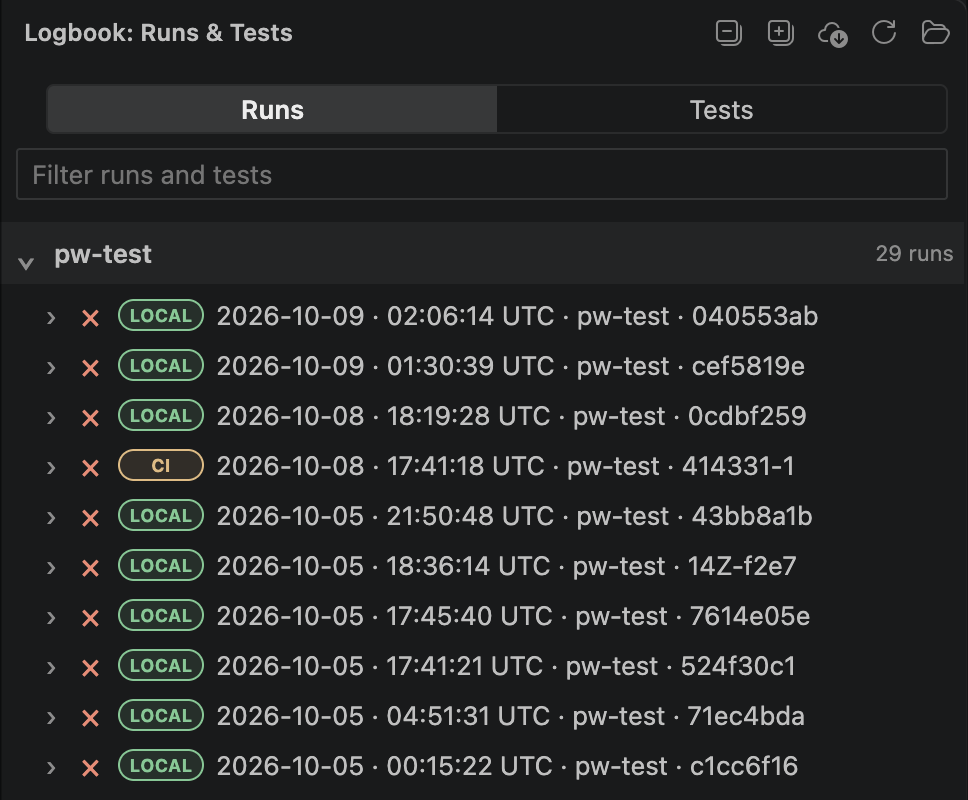

<p align="center">
  
</p>

<h1 align="center">Playwright Logbook</h1>

<p align="center">Playwright test reports, history, and evidence for AI-assisted debugging</p>

<p align="center">
  <a href="https://www.npmjs.com/package/playwright-logbook"></a>
  <a href="https://github.com/krishnapollu/playwright-logbook/actions/workflows/ci.yml"></a>
  <a href="https://www.npmjs.com/package/playwright-logbook"></a>
  <a href="https://marketplace.visualstudio.com/items?itemName=krishnapollu.playwright-logbook-vscode"></a>
</p>

**[Install from npm](https://www.npmjs.com/package/playwright-logbook)** · **[VS Code extension](https://marketplace.visualstudio.com/items?itemName=krishnapollu.playwright-logbook-vscode)** · **[View the source on GitHub](https://github.com/krishnapollu/playwright-logbook)**

Playwright Logbook turns every test run into a searchable, self-contained report with failure details, retry history, flaky-test tracking, project views, and CI-friendly summaries. It also gives coding agents focused evidence from a selected failure and its history, helping them investigate likely causes and evaluate proposed fixes across runs.

It works with the Playwright setup you already have. There is no hosted service, database, or account to configure.

## Contents

- [Why teams use it](#why-teams-use-it) · [Install](#install) · [Add it to Playwright](#add-it-to-playwright)
- [VS Code extension](#vs-code-extension) · [Investigate with a coding agent](#investigate-with-a-coding-agent)
- [Use it in CI](#use-it-in-ci) · [Portable CI run bundles](#portable-ci-run-bundles) · [Terminal commands](#terminal-commands)
- [Reporter options](#reporter-options) · [Attachments and privacy](#attachments-and-privacy) · [What happens to your data?](#what-happens-to-your-data) · [Documentation](#documentation)


## Why teams use it

- Find the failed test, its attempts, error, code frame, steps, and artifacts in one place.
- See flaky tests and recent run history instead of investigating one run at a time.
- Review results across projects and CI shards in a single HTML report.
- Give a coding agent a bounded investigation task with errors, retries, steps, artifact references, and prior outcomes for one test.
- Keep reports local and offline by default. Logbook does not change Playwright's exit code or upload data automatically.


## Install

```sh
npm install --save-dev playwright-logbook
```

Logbook supports Node.js 20+ and Playwright 1.42+.

## Add it to Playwright Suite

Add Logbook to your existing reporter list in playwright config:

```ts
// playwright.config.ts
import { defineConfig } from '@playwright/test';

export default defineConfig({
  reporter: [['list'], ['playwright-logbook']],
});
```

Run Playwright normally:

```sh
npx playwright test
```

Then open `.logbook/report/index.html`. The report is a single local HTML file and works without a server.

## VS Code extension

Install [Playwright Logbook for VS Code](https://marketplace.visualstudio.com/items?itemName=krishnapollu.playwright-logbook-vscode) alongside the reporter. Run your tests, then open **Logbook** in VS Code's activity bar. Open the folder containing your Playwright configuration; the extension reads its `.logbook/` history. It requires desktop VS Code 1.95+.

- **Find a run or test:** Filter Recent Runs by status, branch, test name, ID, project, or path. You can also filter to a spec or test from the editor. Open a run overview for counts and project breakdowns.
- **Investigate a failure:** Read the recorded error, retries, steps, logs, and available attachments. Jump to the failure location or test definition in the current checkout.
- **Compare history:** Select an earlier execution to see what changed, including a source diff when the recorded revisions are available locally.
- **Bring CI evidence home:** Fetch a recent GitHub Actions artifact or import a [portable run bundle](docs/RUN-BUNDLES.md) to inspect its recorded results in the same history view.




VS Code Recent Runs sidebar showing recorded tests


VS Code test failure detail with error, retries, source actions, and history


VS Code comparison of a passing and failing execution


See the [extension README](packages/vscode/README.md) for setup, monorepos, custom history paths, and CI imports.

## Investigate with a coding agent

Prepare a task for one recorded test execution with its errors, retries, steps, available attachment paths, and matching history:

```sh
npx playwright-logbook analyze --run latest --test <testId> --source
```

Review the task and submit it to your coding agent. In VS Code, select a test and choose **Analyze with AI** to hand an unsent task to a supported installed assistant. The agent can inspect the evidence and code, propose a fix, and use later test runs to assess it. Logbook does not edit tests, run an agent, or treat a passing retry as proof of a fix. Use `debug` for a compact evidence packet; see the [CLI reference](docs/CLI.md).


## Use it in CI

Each shard writes its own record. Give all shards the same run ID and upload their shard files as CI artifacts:

```sh
LOGBOOK_RUN_ID=ci-123 npx playwright test --shard=1/4
```

In a follow-up job, download the shard artifacts and merge them:

```sh
npx playwright-logbook merge \
  --run-id ci-123 \
  --from all-shards \
  --fail-on-incomplete

npx playwright-logbook summary --run ci-123 --format markdown
```

The merge creates `.logbook/report/index.html` and updates local history. Persist `.logbook/runs/` and `.logbook/index.jsonl` between CI runs to keep trends and flaky-test history.

See [CI recipes](docs/CI.md) for GitHub Actions, Azure DevOps, artifact retention, and Playwright blob-report workflows.

## Portable CI run bundles

Export a saved run as a ZIP and import runs from other machines into existing local history. Optional file attachments include screenshots, videos, traces, and custom logs. See [setup, CI recipe, and import behavior](docs/RUN-BUNDLES.md). Bundle support requires **playwright-logbook 0.3.0 or newer**.

## Terminal commands

```sh
npx playwright-logbook history
npx playwright-logbook flaky
npx playwright-logbook summary --format markdown
npx playwright-logbook report --run latest
npx playwright-logbook debug --run latest --test <testId> --format markdown
```

Use `--root <dir>` when running the CLI outside your Playwright project. See the [CLI reference](docs/CLI.md) for all commands and exit codes.

## Reporter options

```ts
reporter: [['playwright-logbook', {
  outputDir: '.logbook',
  historyLimit: 30,
  captureDetails: true,
}]],
```

| Option | Default | Description |
| --- | --- | --- |
| `outputDir` | `.logbook` | Output directory, relative to the project root |
| `runId` | Detected | Explicit run ID; `LOGBOOK_RUN_ID` can also set it |
| `title` | None | Label shown in the report |
| `redact` | `[]` | Strings or regular expressions to remove from diagnostics |
| `autoMerge` | `true` | Merge automatically when the run is not sharded |
| `autoReport` | `true` | Generate HTML after an automatic merge |
| `historyLimit` | `30` | Number of runs used for trends and flaky analysis |
| `maxTextLength` | `4000` | Maximum stored diagnostic text length |
| `quiet` | `false` | Suppress the final Logbook terminal line |
| `captureDetails` | `false` | Capture steps, output, and failed-test screenshots |

## Attachments and privacy

Logbook stores outcomes, attempts, errors, tags, case IDs, project metadata, and relative artifact references. It does not copy trace, video, or screenshot files into run records.

Configure traces in Playwright, for example:

```ts
use: { trace: 'on-first-retry' }
```

If you enable `captureDetails`, Logbook can store sanitized steps, output tails, and bounded PNG/JPEG images from failed or flaky tests. Screenshots can contain sensitive information; text redaction cannot remove secrets visible in pixels. Review reports and debug packets before sharing them.

## What happens to your data?

By default, the reporter writes history under your project's `.logbook/`. Logbook has no hosted retention policy and performs no automatic AI or test-management upload. CI fetches and manual ZIP imports add runs to local history. Remove `.logbook/` when you no longer need it.

## Documentation

- [CLI reference](docs/CLI.md)
- [CI recipes](docs/CI.md)
- [Record schema](docs/SCHEMA.md)
- [Adapter guidance](docs/ADAPTERS.md)
- [Changelog](CHANGELOG.md)

## License

MIT
