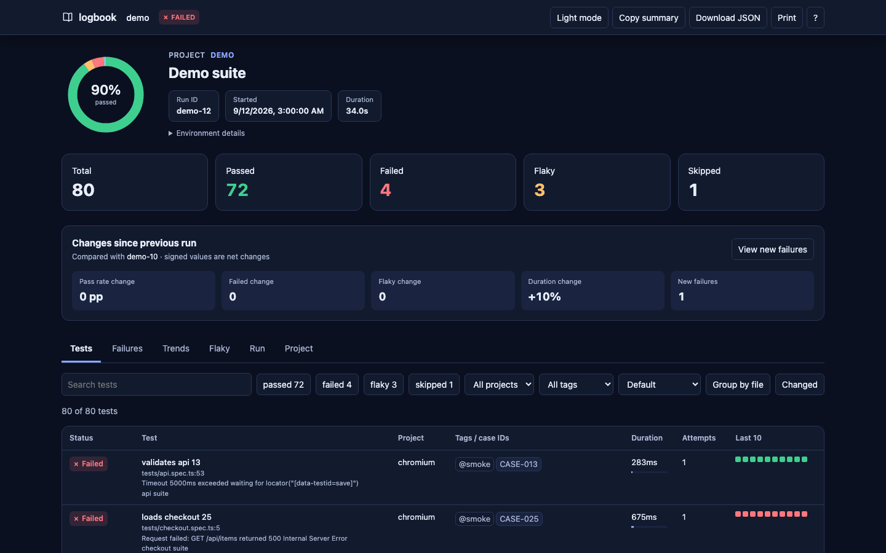
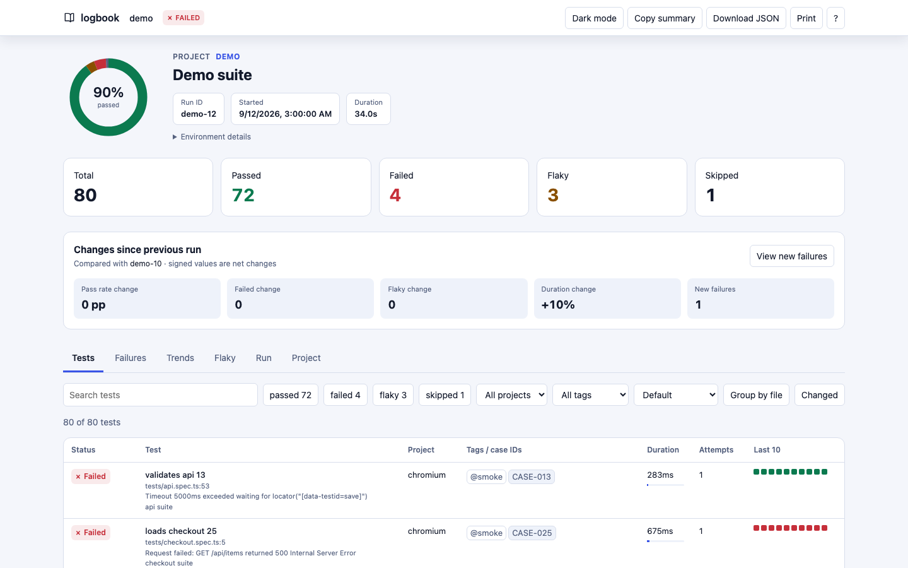
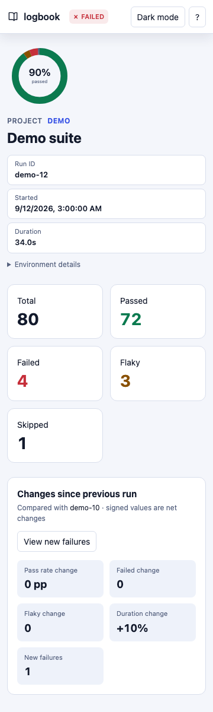

# playwright-logbook

Playwright test reports with run history, flaky-test tracking, and a single-file HTML report.

Logbook adds a reporter to your existing Playwright suite. After a run, open the report to see failures, retries, trends, and results by project. It also provides a CLI for reviewing past runs and combining CI shards. It runs locally without a service and does not change Playwright's exit code.

> **Release status:** Version `0.2.0` is in this repository but has not been published to npm. You can [try the included sample](#try-the-sample-project) now. The install command below applies once a release is available.



The report has a searchable test table, status filters, a detail panel with errors and rerun commands, failure groups, trends, flaky history, and project breakdowns. The detail panel can preview and copy a bounded, redacted debug context for an AI assistant; it is evidence, not an AI diagnosis, and should be reviewed before sharing. The report works from a local file without a server. Light mode is the default; use the theme control to switch to dark mode. The layout also fits narrow screens.





## Get started

Install Logbook alongside Playwright:

```sh
npm i -D playwright-logbook@next @playwright/test
```

Add Logbook to the `reporter` setting in `playwright.config.ts`. Keep your existing reporter if you want its terminal output:

```ts
import { defineConfig } from '@playwright/test';

export default defineConfig({
  reporter: [['list'], ['playwright-logbook']],
});
```

Run your tests as usual:

```sh
npx playwright test
```

Open `.logbook/report/index.html` in a browser. The HTML report is self-contained and works offline. A run record is also saved under `.logbook/runs/`.

## Review runs from the terminal

```sh
npx playwright-logbook history
npx playwright-logbook flaky
npx playwright-logbook summary --format markdown
npx playwright-logbook report --run latest
npx playwright-logbook debug --run latest --test <testId> --format markdown
```

`history` lists recent runs, `flaky` highlights tests that change between passing and failing, `summary` produces a concise result for CI, `report` regenerates the HTML for a stored run, and `debug` exports one test's AI-ready context. Use `--root <dir>` if you are running the CLI outside your Playwright project. See the [CLI reference](docs/CLI.md) for all commands and exit codes.

History is stored in files under `.logbook/`, not in a hosted service. On your machine it remains available until you remove those files. In CI, persist `.logbook/runs/` and `.logbook/index.jsonl` between workflow runs if you want cross-run trends and flaky analysis.

## Use in sharded CI

Each shard writes a separate record and leaves merging to a later job. Give shards the same `LOGBOOK_RUN_ID`, run Playwright with its normal shard option, and upload `.logbook/shards/` from every shard:

```sh
LOGBOOK_RUN_ID=ci-123 npx playwright test --shard=1/4
```

After downloading all shard artifacts into `all-shards/`, merge them and publish the resulting report:

```sh
npx playwright-logbook merge --run-id ci-123 --from all-shards --fail-on-incomplete
npx playwright-logbook summary --run ci-123 --format markdown
```

The merge writes `.logbook/report/index.html` and updates history. `--fail-on-incomplete` makes the merge job fail if a shard is missing, while still writing the available results. See [CI recipes](docs/CI.md) for GitHub Actions, Azure DevOps, artifact handling, and Playwright blob-report replay.

## Reporter options

Pass options as the second item in the reporter configuration:

```ts
reporter: [['playwright-logbook', { outputDir: '.logbook', historyLimit: 30 }]],
```

| Option | Default | Use |
| --- | --- | --- |
| `outputDir` | `.logbook` | Set the output directory relative to the project root |
| `runId` | Detected | Assign a run ID; `LOGBOOK_RUN_ID` can also supply one |
| `title` | None | Label the run in the report |
| `redact` | `[]` | Remove specified strings or regex matches from diagnostics |
| `autoMerge` | `true` | Save a merged run automatically when not sharded |
| `autoReport` | `true` | Generate HTML after an automatic merge |
| `historyLimit` | `30` | Limit runs used for report trends and flaky analysis |
| `maxTextLength` | `4000` | Limit stored diagnostic text length |
| `caseIdPatterns` | Built-in ID pattern | Customize test-management ID extraction |
| `quiet` | `false` | Suppress Logbook's final terminal line |
| `captureDetails` | `false` | Opt in to steps, stdout/stderr, and inline failed-test screenshots; `true` enables all, or choose `{ steps, output, images }` |
| `maxSteps` | `100` | Limit captured steps per attempt |
| `maxOutputLength` | `2000` | Keep the tail of stdout/stderr, in characters |
| `maxImageBytes` | `250000` | Skip individual images larger than this |
| `maxEmbeddedBytes` | `5000000` | Cap embedded images per run |

## What is stored

Logbook stores test outcomes, attempts, errors, tags, case IDs, and project/CI metadata. Paths in its records are relative to the project. By default, the report links to screenshots, traces, and videos; retain those files if you share the report. Attachment bodies are not copied into Logbook records.

With `captureDetails: true`, Logbook also stores sanitized step titles and output tails, and embeds PNG or JPEG images from failed or flaky tests within the size limits above. Screenshots can contain sensitive data: text redaction cannot remove secrets visible in pixels. Review captured images before sharing a report or run JSON.

There is no server, automatic retention policy, or test-management publisher in this release. See the [schema](docs/SCHEMA.md) for the record format and [adapter guidance](docs/ADAPTERS.md) for future integrations.

## Try the sample project

From this repository's root, run the included Playwright project without installing a browser:

```sh
npm ci
npm run build
cd fixtures/sample-project
LOGBOOK_RUN_ID=docs-example node ../../node_modules/@playwright/test/cli.js test
```

The sample intentionally contains failures and a flaky test, so Playwright exits with code `1`. An actual run printed:

```text
[logbook] run docs-example: 3 passed, 2 failed, 1 flaky, 1 skipped -> .logbook/report/index.html
```

Open `.logbook/report/index.html` from the sample-project directory, or run `node ../../dist/cli/bin.js summary --run docs-example --format markdown` to inspect the stored result.

For a larger deterministic showcase, run `npm run demo` from the repository root and open `.logbook-demo/report/index.html`. Run `npm run test:e2e` for the offline browser smoke test and `npm run shots` to regenerate the screenshots above.
