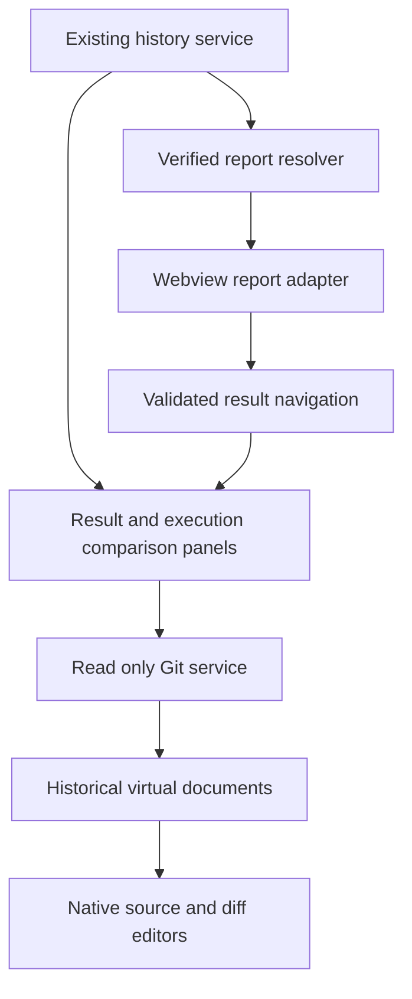

# Playwright Logbook VS Code Next Phase Specification

**Specification version:** 0.3.1  
**Status:** Approved direction for the next iteration; embedded reports deferred  
**Date:** 2026-10-03  
**Baseline:** Specification 0.2.0 and the locally implemented Recent Runs → result → history → recorded source flow  
**Implementation status:** User reports basic local loading works; broader validation remains outstanding.

## 1. Product direction

Extend the existing editor flow with clearer result presentation and evidence from two recorded executions and their committed source. Keep native Recent Runs as the main navigation. Richer content belongs in editor tabs. An overall embedded run report is future work, dependent on retained run-specific report copies.

The current iteration's journey is recent run → particular result → earlier execution → execution comparison → committed file difference. Existing source navigation remains available throughout. Changes provide investigation context; they do not establish why a failure occurred. The overall report joins this journey only when the deferred report work is enabled.

This document supplements specification 0.2.0. It does not assert that the current repository records all metadata required by this design. The coding assistant must verify Git metadata and existing shared APIs before choosing an adapter; report association and rendering discovery belong to the deferred report stage. Release/package versions remain independent of this specification version. The filename remains unchanged.

## 2. Delivery order and prerequisite validation

| Stage | Deliverable | Exit gate |
| --- | --- | --- |
| Readiness | Focused validation of the implemented core flow | Verify outcomes, retries, expected failures, run errors when recorded, identity, refresh preservation, missing source, partial records and two-root isolation; record limitations |
| A (deferred) | Retained run-specific reports, followed by verified report action and embedded report tab | Explicitly scheduled future work; retained HTML and required assets, verified report/run association, safe working links and multiple-run behavior |
| B | Result, attempts and history visual refresh | Consistent outcome semantics, keyboard use and light/dark/high-contrast readability at narrow widths |
| C | Two-execution comparison with recorded Git context | Pinned pair with matching test/project identity; trustworthy outcomes, errors, attempts, duration labels and unknown metadata |
| D | Historical committed source and native Git file diffs | Read-only local revision access; no fetch/checkout/write; correct repository/path mapping and explicit unavailable states |

Readiness is a focused check of the new extension, not an instruction to repeat every unrelated project test. Validate features beyond basic loading before they become the base for new panels. Current delivery order is Readiness → B → C → D. Stage A is not a prerequisite or release gate for this iteration. Stage C works even without Git; Stage D is an optional investigation action on a completed comparison.

## 3. Stage A overall run report (deferred)

The current reporter overwrites `report/index.html`; there is no guaranteed retained report copy for each execution. Do not implement report association discovery, a latest-report loader, report commands, placeholder unavailable-report panels or report/detail navigation in this iteration. Do not recreate historical HTML merely to enable a viewer.

Future work may retain named per-run HTML copies and all required assets, with an explicit run-ID reference or manifest. A named file alone does not establish association. Schedule this additive generator change before enabling the embedded viewer. The requirements below are retained as future design guidance, not current acceptance gates. The extension must continue to work with older stores that lack retained reports.

### Discovery and report scope

Determine whether the current report is run-specific, aggregates multiple runs or is regenerated at a mutable latest path. Record the supported association mechanism: a persisted run/report reference, embedded verified metadata, or an explicit manifest generated by Logbook. File names, timestamps and proximity to a store are not sufficient association evidence.

If the report covers multiple runs, label it Overall history report and navigate/filter to the selected run only when the report supports a verified run identifier. Do not present a multi-run report as the summary of one execution. A mutable latest report is not a historical snapshot; when identity no longer matches, show association unavailable instead of quietly loading the newest report.

A future reporter/report-generator change may persist immutable report references or an explicit run-ID manifest. This must be an additive compatible change, not a silent migration of existing stores.

### Entry points

Provide View Run Report through the run row context menu, a native inline action and a selected-run command. Place a visibly labeled View Run Report item first under the expanded run so discoverability does not depend on hover. No test expansion is required. The result detail header also includes the action.

Offer a run-specific report only when its association is known. For unknown association, show Report unavailable as a status/detail with a short explanation and a recheck action, rather than an enabled View Run Report command pointing to an arbitrary report. For a known association whose files are missing, invoking the action may open the explicit missing-files state.

### Tabs and navigation

One report panel per workspace/store/run/report identity. Reopening the same identity reveals its existing tab; opening another run creates a separate tab. Include short run ID, date/time and project when needed for disambiguation. Never repurpose an existing Run A tab to display Run B. Closing a tab releases its resources. Keep hidden-tab state compact rather than retaining a browser instance indefinitely.

The report header shows selected run, generated report scope and provenance. Report result links open the extension detail view using verified execution IDs. Detail views offer Return to Run Report. Reuse the detail panel where appropriate, preserving the run context; a report tab stays bound to its own run.

If a report result lacks a reliable mapping to extension identity, preserve its report-local inspection rather than opening a guessed test. Browser hash navigation and report-local filtering remain local to that report.

### Embedding strategy

Prototype with a real generated report before building the full integration. Audit scripts, inline code, dynamic imports, styles, data loads, browser routing, links and artifact references. Use a report adapter with extension-owned rendering code/assets and validated data where possible. Reuse report presentation; do not build a second interpretation of outcomes.

Do not execute arbitrary JavaScript from a copied historical report or add broad unsafe script permissions simply to make embedding work. Supported generated-report versions may require an explicit webview-compatible renderer/export using the same report components. If existing HTML cannot safely work, report that limitation and define the adapter before committing to a generic HTML loader.

Convert approved resource paths through asWebviewUri, restrict localResourceRoots, set a restrictive content security policy and validate all webview messages in the extension host. Escape report text. Restrict artifact paths, including symlink traversal. Do not trust scripts merely because the report file is local. Use extension-owned validated messages for navigation instead of unrestricted command links. No local web server or hosted service is required.

History interpretation and resource validation remain read-only in restricted workspaces; active report scripts and process actions are gated according to the existing trust policy. A text/data fallback may remain available. Known unsupported report versions get an explicit Unsupported embedded report state. External browser opening can be a secondary explicit fallback, not the acceptance path for successful embedding.

### Stage A states

| State | Display and action |
| --- | --- |
| Verified report and readable assets | Open the run-bound report tab |
| No report reference recorded | No linked report available; offer recorded results and generation guidance based on actual supported CLI |
| Report association unknown | Do not imply ownership; explain that run association cannot be verified |
| Known reference, missing HTML | Report files unavailable; show recorded path, Recheck and View recorded results |
| Missing styles/scripts | Report assets unavailable; useful error details rather than a blank panel |
| Unsupported report version or script requirements | Embedded report unsupported; recorded results remain usable |
| Missing artifact | Artifact unavailable; keep the report and other results usable |
| Restricted Mode | Explain the disabled active report view and retain safe recorded details |

## 4. Stage B visual design

Use the existing HTML report as brand inspiration, after inspecting its actual styles. Mockups infer a restrained VS Code presentation; they are not screenshots of the current report. The screenshots in `docs/img/extension/` are illustrative references. Their Layout, Appearance and Recorded data selectors are design-preview controls, not extension features. Omit report actions, report tabs and report-state screens from this iteration; preserve them for deferred Stage A.

Keep the activity bar, Recent Runs tree and editor tabs native. Sidebar cards, large colored selection blocks, buttons and the combined narrow sidebar/editor layout in the mockups are conceptual guidance, not a requirement to replace VS Code's tree with a custom webview. Use native icons, descriptions, context menus and appropriate inline actions; apply richer cards and action rows in editor panels.

Use actual recorded run IDs, shortened for display with the full identity accessible. Do not manufacture sequential numbers such as the illustrative #104. Show date/time and project where needed to distinguish runs and retain execution/repeat identity in comparisons.

Hierarchy: result title and textual outcome first, run/project and recorded Git context second, principal source/comparison actions next, then error, attempts and history. Add report actions only when Stage A ships. Error text uses a bounded visual area with full content accessible; do not truncate the primary diagnostic without an expansion option. History stays beside the error at wider widths and below attempts in narrow panes.

Use one consistent mapping across report, detail and comparison: red for unexpected failure, green for expected successful outcome, amber for retry recovery or incomplete execution, neutral for skips and unknowns. Text and icon distinguish semantically different outcomes sharing a color. Expected failures remain labeled Failed as expected; unexpected passes remain labeled Passed unexpectedly. Colors must not redefine outcome classification.

Use VS Code theme variables for actual panels, including foregrounds, editor/sidebar backgrounds, borders, links, buttons and testing outcome colors where available. Small badge fills provide emphasis; large decorative gradients and oversized dashboard cards are unnecessary. Native tree icons remain consistent with the panel meanings.

Support light, dark and high-contrast themes; visible keyboard focus; semantic controls; useful screen-reader names; zoom; long test names, paths and errors. Check readable contrast on the actual composed surfaces. Do not claim accessibility merely from token usage.

Correct the light-theme mockup's nearly invisible run title, counts and Results heading: titles and primary values use theme foreground colors, not dark-theme pale text carried into light surfaces. Use readable secondary foregrounds for metadata; essential metadata must not be styled as disabled text. Aim for at least 4.5:1 contrast for normal text, 3:1 for large text and meaningful control boundaries/focus indicators. Verify built-in light, dark, high-contrast dark and high-contrast light themes; custom themes should inherit VS Code tokens with sensible fallbacks. Theme changes update existing panels without losing selection or comparison state.

Keep color emphasis primarily in badges and icons; error text remains readable on the editor surface or a subtle themed surface. High-contrast views use explicit borders and text/icon labels rather than relying on translucent fills. Preserve visible focus, native font sizing and zoom behavior. Avoid horizontal page overflow; long paths wrap and long diagnostic lines may scroll within their own labeled area.

Place recovery actions beside the relevant state: missing current source shows a visible Configure Source Mapping action; unavailable historical revisions or Git show the reason beside the affected source/diff action. Do not rely on hover tooltips or a faded button alone to explain unavailability. When only one historical side is available, keep that side's source action usable and explain why the two-file diff is unavailable. Do not offer automatic fetch as recovery.

At a 320–400 px editor pane, stack details and history, wrap action rows and status metadata, collapse optional detail through labeled disclosures, and stack execution comparison cards with baseline/selected labels retained. Native sidebar remains a separate VS Code surface; a combined narrow review mock shows its contents stacked only to make both surfaces inspectable.

## 5. Stage C two-execution comparison

### Pair selection

From the selected result's history, choose Compare with selected on one earlier execution. The earlier result becomes Baseline and the current selection becomes Selected. Compare executions, not merely run summaries: repeat executions and retry attempts retain their own identities.

Require verified canonical test and project matching. Default candidates to the visible history scope; show branch labels on both sides. A deliberate cross-branch selection is allowed with a clear scope difference when identity remains reliable. Unknown identity cannot be overcome by matching display titles. Changing the selected execution requires an explicit action.

Pin the pair while new history arrives. Keep its run IDs, execution IDs, dates, project, branch and recorded commit visible. If one result is removed, mark that side unavailable and retain the other. Do not substitute another result automatically.

### Comparison content

| Field | Required behavior |
| --- | --- |
| Outcome | Actual status plus expected outcome; retry recovery remains visible |
| Errors | Display available structured/message errors side by side; No error recorded is distinct from missing error metadata |
| Attempts | Counts and per-attempt summaries; missing attempts do not imply zero retries |
| Duration | Name the metric, such as final-attempt duration or total recorded attempt duration; compare only the same definition |
| Source | Recorded path and project; historical paths can differ |
| Git | Recorded branch, commit and recorded working-tree state; unknown is explicit |
| Completeness | Preserve incomplete/unknown execution and result warnings |

Duration changes are descriptive. Timeouts, retries, environment differences and limited samples prevent a performance-regression claim. Similar errors and code changes do not confirm the same cause.

Recorded Git context is available even if the commit object is absent locally. Stage C must not depend on a local repository or Git binary. A missing branch/commit does not block outcome comparison.

## 6. Stage D historical source and file diffs

### Meaning of a recorded commit

View source at recorded commit shows committed content at that revision. It is not necessarily the source that executed: the run may have used uncommitted changes, generated files or a different repository. Recorded working-tree state is shown as clean, dirty or unknown only from run-time metadata. Current Git status cannot reconstruct historical cleanliness.

Branch names and HEAD at viewing time must never substitute for the recorded commit. Prefer immutable full object IDs; if only abbreviated IDs exist, resolve locally without ambiguity and store the resolved identity for the open view. Missing or ambiguous revisions produce explicit states.

### Read-only implementation

Resolve the mapped repository independently for each side. Multi-root workspaces, nested repositories and archived records need explicit provenance/path mapping. A commit being available does not prove a configured repository belongs to the recorded run; disclose mapping uncertainty.

Use a narrow Git service with validated local object reads and an explicit argument array, never shell-interpolated revision/path strings. Gate process access on Workspace Trust. Verify object type as commit and resolve paths within the repository; handle symlinks, blobs and unsupported content explicitly. Do not run project hooks, report commands or workspace executable code to retrieve source.

Expose committed text through a read-only TextDocumentContentProvider with stable URIs containing repository identity, resolved commit and repository-relative path. Preserve the source extension for syntax highlighting. Use VS Code's native diff editor via vscode.diff with two read-only historical resources. Opening a file or diff must not checkout, reset, stage, fetch or modify the working tree. Git unavailable and Restricted Mode disable only Git actions.

The command Compare test file between runs compares the recorded file path on each side, rather than assuming a single current path. If the file was renamed, only use independently verified recorded paths or a disclosed mapping; do not guess a title-based correspondence. If a recorded test rename changed canonical identity, the standard comparison flow does not silently join those histories.

Compare committed revisions even when the recorded working-tree state is dirty or unknown, but label the limitation next to the action and in the view. Comparing against the current working tree is a future separately labeled action; it must not be presented as comparison between the two executions.

### Git states

| State | Behavior |
| --- | --- |
| Both local commits/files verified | Enable historical source actions and native file diff |
| No recorded commit | Commit not recorded; outcome comparison remains usable |
| Revision missing locally | Recorded revision unavailable locally; no automatic fetch |
| Ambiguous revision | Cannot resolve recorded revision uniquely; request explicit mapping or use unavailable state |
| No mapped repository | Repository mapping unavailable; show Configure Source Mapping |
| Git unavailable or trust restricted | Explain disabled Git actions; history and safe details remain usable |
| File absent at revision | File unavailable at recorded revision; show path and revision; do not substitute current file |
| Dirty at execution | Committed content excludes uncommitted changes present during the run |
| Historical working-tree state unknown | Cannot establish whether committed content matches executed source |
| Same commit | No committed revision change; dirty/untracked changes may still be unknown; compare outcomes normally |

Later relevant application, fixture and configuration diffs require explicit user-selected files or verified dependency evidence. They must not be introduced as automatically identified failure causes.

## 7. High level component changes

Keep shared history/outcome logic in the existing library boundary. ReportResolver establishes scope and association; ReportAdapter owns webview compatibility; ReportPanelRegistry owns run-bound tab identities. ComparisonService builds a pinned, bounded view model independent of Git. GitSourceService and HistoricalDocumentProvider implement optional local source access. UI messages contain validated record IDs, not arbitrary commands or executable paths.

ReportResolver, ReportAdapter, ReportPanelRegistry and the report branches in the diagram are deferred with Stage A. Implement only the detail/comparison and optional Git branches in this iteration.

## 8. Acceptance and verification

| ID | Acceptance criterion |
| --- | --- |
| NEXT-001 | The report action is accessible at run level without expanding a test |
| NEXT-002 | Run-specific reports are shown only with verified association; multi-run reports retain their true scope |
| NEXT-003 | Opening the same report reveals its tab; two different runs retain distinct identities and content |
| NEXT-004 | Supported report assets, result links and permitted artifact links work in the embedded view; unsupported/missing assets produce a readable state |
| NEXT-005 | Report/detail round trips preserve selected run/result context |
| NEXT-006 | Result, attempts and history are readable in light/dark/high-contrast dark/high-contrast light, at 320–400 px widths, zoom and keyboard-only use; primary headings/counts retain contrast and theme changes preserve state |
| NEXT-007 | Existing expected-outcome and retry semantics remain consistent across all views |
| NEXT-008 | Comparisons pin two verified executions and correctly distinguish missing fields, metric definitions and removed records |
| NEXT-009 | Recorded Git context remains distinct from current Git state and from executed-source claims |
| NEXT-010 | Locally available historical source opens read-only; native diff uses both recorded revisions and paths |
| NEXT-011 | Missing commits/files, same commits, dirty/unknown run state, mapping ambiguity and unavailable Git degrade explicitly |
| NEXT-012 | Source/diff actions cause no checkout, fetch or working-tree modification and cannot execute injected commands |
| NEXT-013 | Refresh preserves existing selection and comparison pair; report identity preservation applies only when deferred Stage A ships |
| NEXT-014 | Readiness checks and relevant existing reporter/CLI/report regressions pass after shared changes |
| NEXT-015 | Missing-source and unavailable-Git states expose nearby explanations and applicable recovery actions; an unavailable side does not disable the other side's valid historical-source action |
| NEXT-016 | Native navigation is retained and displayed run identifiers come from recorded data; no synthetic sequential run numbers or design-preview controls appear in product UI |

NEXT-001 through NEXT-005 are deferred with Stage A and do not block this iteration. NEXT-006 through NEXT-016 apply now, with the report portion of NEXT-013 deferred.

When Stage A resumes, use real retained generated reports as integration fixtures, including a multi-run report and a replaced latest report when supported; test CSP/resource restrictions and malicious report text/paths. For the current iteration, use a disposable local Git fixture with two commits, changed/renamed/absent files, same-commit runs and dirty/unknown recorded state. Assert working-tree and HEAD state remain unchanged before/after viewing/diffing. Verify multi-root mapping and archive provenance with isolated stores. Mockups use illustrative data and do not validate the implementation.

## 9. Decisions for the coding assistant

Proceed with B → C → D after the focused readiness check. Record Git metadata availability for C/D without blocking B. Do not begin Stage A discovery or embedding in this iteration. When retained per-run HTML generation is separately scheduled, begin A with a brief discovery matrix covering report scope, association, retained paths/assets, rendering dependencies, result identity mapping and artifact paths.

Reuse existing history semantics and report visual conventions. Do not implement a generic arbitrary-HTML execution feature. Deferred report requirements are not a blocker for B/C/D. Avoid broad repository restructuring. Routine design refinements are authorized where they improve readability and use across themes while preserving the specified semantics.

Future report policy is one run-bound tab per identity. Default comparison is one earlier matching execution against the selected one, with both sides pinned. Historical Git actions stay optional and local. No application/fixture relevance inference, remote fetching, test execution or confirmed-cause language is included in these stages.

## 10. Official implementation references

- [VS Code Webview API](https://code.visualstudio.com/api/extension-guides/webview) for resource conversion, CSP, messaging and theme integration.
- [VS Code virtual documents](https://code.visualstudio.com/api/extension-guides/virtual-documents) for read-only historical content.
- [VS Code built-in commands](https://code.visualstudio.com/api/references/commands) for native vscode.diff.

Verify supported APIs against the extension's declared minimum VS Code version during implementation.

## 11. Revision history

- **0.3.1 (2026-10-03):** User approved deferring embedded reports until retained per-run copies are available; current order changed to Readiness → B → C → D. Approved native sidebar guidance, actual recorded run IDs, actionable unavailable states and theme/accessibility refinements. Existing report wireframes remain future references; report acceptance gates are explicitly deferred.

## 12. Approved compact usability iteration

Implement the user-approved actual-editor review findings as one usability task:
compact result headers/cards/controls; second-resolution UTC timestamps with
shortened recorded IDs and accessible full IDs; test-definition and structured
failure-location actions; compact history with a Current marker; pinned comparison
change summary and errors before collapsed metadata; optional committed-source
controls in a labeled disclosure; per-attempt recorded steps/stdout/stderr with
explicit absent versus empty capture; native run-scoped test search with outcome
filters; and a record-backed run overview showing saved counts and run errors.
The overview is independent of deferred HTML association. Never derive failure
locations from snippets or stack text, or claim matching error messages establish
cause. Preserve safe path mapping, escaped content, unknown metadata, bounded
record reads, theme tokens, keyboard focus and responsive stacking.

Done when: relevant reader/presentation tests, full check, packaged editor journey,
and visual narrow/wide layout checks pass. Actual all-theme/keyboard acceptance
and Windows/Linux checks remain separately tracked.

## 13. Approved investigation workspace redesign

Replace repeated nested attempt accordions with a single attempt inspector: an
attempt tab row and a distinct Steps / Output / Errors evidence tab row. Default
to the final recorded attempt, prioritize recorded steps then output then errors,
and preserve tab selections for the same execution on refresh. Use accessible
tab/tabpanel semantics, roving focus, arrow/Home/End navigation and visible focus.

Use labeled context pills for project/run/attempt count and available recorded Git
context. Keep outcome colors semantic; missing values stay explicit. Show assertion
fields as aligned label/value rows, distinguish primary failure navigation from
secondary test-definition navigation, and render history as a compact timeline with
an explicit Current pill. Move provenance to a technical footer and history evidence
below its timeline. Raw diagnostic disclosures have distinct document controls.
Run overview totals use status-labeled metric tiles. Comparisons retain aligned
errors, pinned identities, unknown states and clearly labeled technical disclosures.

Done when: full checks, packaged host journey, tab click/keyboard/refresh checks,
and narrow/wide visual inspection pass. Broader all-theme native-editor acceptance
and Windows/Linux validation remain outstanding separately.
