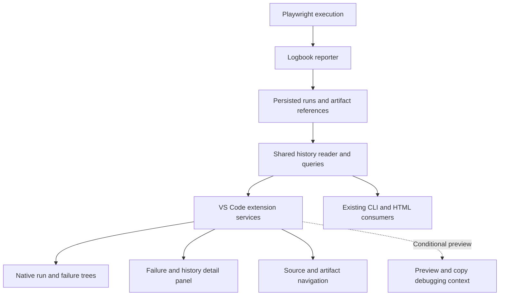

# Playwright Logbook VS Code Extension

Architecture, development plan and specification

**Specification version:** 0.2.0  
**Status:** Draft for implementation planning  
**Date:** 2026-10-03  
**Initial extension release target:** 0.1.0 preview  
**Repository:** Existing playwright-logbook repository  
**Product name:** Playwright Logbook for VS Code

## 1. Product decision

**Value proposition:** See a Playwright failure’s recorded history and jump to its source inside VS Code.

Build an editor interface over Logbook history within the existing Logbook repository. Publish the extension separately from the npm package. Reuse collection, test identity and historical analysis through a small shared library boundary.

The primary audience is test authors investigating repeated local failures. Copied CI records are a secondary workflow; automatic CI retrieval is deferred. Compatible records are required for viewing results, but multiple executions are required only for historical value.

Onboarding copy: “Logbook reads history collected by its reporter. For CI results, download the Logbook records and select their folder. This preview does not fetch CI records automatically.” Copy the compatible store and relevant artifacts; an HTML report alone is not assumed to be sufficient.

The proposed improvement over Logbook HTML is fewer steps between recorded history and source editing. The official Playwright extension already supports running, debugging and generating tests, including Trace Viewer integration. Logbook contributes access to persisted cross-run history. This is a value hypothesis to validate in real debugging sessions. Reference: [Playwright VS Code documentation](https://playwright.dev/docs/getting-started-vscode).

The first release answers four questions: What ran recently? What failed? Has this test failed before? Where is its source?

This document defines a proposed architecture and delivery scope. The current repository and persisted schema have not been inspected for this draft. Storage paths, package exports and interfaces below are proposals, not claims about existing code. Phase 0 must reconcile them with the implementation before coding the extension.

## 2. Goals and scope

| Area | Initial scope |
| --- | --- |
| Users | Playwright test authors debugging repeated local failures, including developers and automation QA engineers |
| Input | Existing compatible Logbook records available locally; manually copied CI stores are a secondary workflow |
| Primary experience | Recent runs, failed tests, test history and source navigation |
| Ownership | Reporter owns collection; shared library owns interpretation; extension owns editor interaction |
| Runtime | VS Code desktop extension host; no hosted service or account required |
| Distribution | Independently versioned VSIX and Marketplace listing from the same repository |

Version 0.1 excludes test execution, healing, cloud synchronization, CI download integrations, direct AI provider calls, inline test CodeLens and a replacement Playwright test explorer. Trace and video viewing are later work; source navigation and readable errors establish the first useful release.

## 3. High level architecture



Collection remains independent of the extension. The extension reads existing persisted records; opening VS Code does not trigger a test run. A missing reporter installation does not prevent viewing compatible archived history.

### Component responsibilities

| Component | Responsibility | Boundary |
| --- | --- | --- |
| Reporter | Record runs, attempts, outcomes, source locations and artifact references | Sole owner of producing run records |
| Shared reader and query library | Validate schema, normalize records, query runs, match test identities and expose history | No VS Code dependencies; reuse established Logbook semantics |
| Workspace resolver | Locate configured stores per workspace folder and maintain root mappings | No automatic execution of project configuration |
| History service | Coordinate reads, bounded caches, refreshes and cancellation | One isolated store context per workspace folder |
| Tree providers | Render folders, runs and failures with counts and status icons | Query summaries; do not load every artifact |
| Detail panel | Display errors, attempts and history using a small webview | Receives validated view models, never raw HTML from reports |
| Navigation service | Resolve recorded paths to current source and supported artifacts | Handles missing files and historical path differences explicitly |
| Context exporter | Conditional preview enhancement: reuse the existing debug packet through an import-safe interface | Bounded preview and explicit Copy; no provider integration |

Use native tree views for navigation and one lightweight webview for details. VS Code supports both patterns; webview assets require URI conversion and resource restrictions. Sources: [Tree View API](https://code.visualstudio.com/api/extension-guides/tree-view), [Webview API](https://code.visualstudio.com/api/extension-guides/webview).

## 4. Repository and dependency plan

Add `packages/vscode/` with its own manifest, extension entry point, services, tree providers, detail panel, tests and packaging configuration. Add architecture and compatibility notes under the repository's existing docs location.

Do not reorganize the full repository solely to add the extension. If the npm package already provides safe library exports, add a supported history-reader subpath and bundle it into the extension. If collection and presentation are tightly coupled, first extract only the required reader, models and queries into an internal shared package. A broader `core/reporter/cli/vscode` monorepo split can follow when justified.

Dependency direction: reporter, CLI, HTML and extension may depend on shared models and queries. The shared layer must never depend on the extension or VS Code. Reading history must not import Playwright runtime code, execute the CLI or load workspace JavaScript.

## 5. Data contract and compatibility

### Minimum normalized information

| Entity | Required information | Optional information |
| --- | --- | --- |
| Store | Schema version, store identity, workspace association | Writer version, indexes |
| Run | Stable ID, start time, recorded completion state or explicit unknown, outcome counts | Duration, branch, commit, project, shard metadata and run-level errors |
| Test identity | Existing canonical test ID and project identity | Relative source path, title hierarchy, parameter identity |
| Test result | Run ID, test identity, distinct execution identity, actual status, expected status or derived outcome | Repeat index, duration, source location and structured errors |
| Attempt | Retry index, status and error details when present | Steps, timing, artifact references |
| Artifact | Kind and recorded path or URI | Label, MIME type, byte size |

Preserve the difference between actual status and expected outcome. Expected failures must not automatically appear as regressions. Failed, timed out, interrupted, skipped and passed outcomes must retain their meaning. A run still being written is incomplete, not successful.

Reuse Logbook's existing identity algorithm. Never match tests by title alone: duplicate titles, projects and parameterized tests can collide. If legacy identity is insufficient, show uncertain matches rather than silently merging histories. Renaming a test creates a separate history unless a future explicit migration exists.

### Proposed shared interface

```ts
interface HistoryReader {
  inspectStore(): Promise<StoreCompatibility>;
  listRuns(query: RunQuery): Promise<Page<RunSummary>>;
  getRun(runId: string): Promise<RunDetails>;
  listFailures(runId: string, query: PageQuery): Promise<Page<TestResult>>;
  getTestHistory(testKey: string, query: HistoryQuery): Promise<Page<TestResult>>;
}
```

The exact interface follows repository discovery. Reads must be asynchronous and cancellable where practical. Pages are bounded; summaries and full details are loaded separately.

Document a supported schema range for each extension release. Unknown newer schemas produce an actionable incompatibility message. Missing schema markers are accepted only through a verified legacy adapter. The extension never migrates or rewrites reporter data. Ignore unknown optional fields within a supported schema.

Keep execution completeness, record readability and schema compatibility separate. A readable record can represent an incomplete run. Report missing shards only when the expected shard set and execution identity are authoritative. Absent completion metadata means completion unknown, not success or interruption. Show run-level errors only when recorded; never infer setup or teardown failure from a zero-test run.

Read only completed records for final summaries. If the existing writer cannot commit atomically, tolerate partial files, debounce notifications and retry briefly without hiding valid older records. A malformed record must not disable the entire store.

## 6. User experience

### Primary flow and layout

Use one dedicated Logbook activity-bar entry containing Recent Runs. Also expose commands through the Command Palette. Do not duplicate the official Test Explorer.

1. Open Logbook and see recent runs newest first, with issue counts and completion information.
2. Expand a run to see unexpected test outcomes, retry recoveries and recorded run-level errors.
3. Select a result to open one detail panel showing its identity, error, attempt summary and compact history.
4. Select an earlier history entry to inspect that execution in the same panel; preserve the originating run and active history scope.
5. Choose Open recorded source location explicitly. Selecting records does not automatically open source tabs.
6. If the optional debug-packet adapter is ready, choose Copy debugging context, review the bounded payload and explicitly copy it.

The navigation hierarchy is workspace folder → run → results and run errors. Hide the folder level in a single-root workspace. Show project identity on results; add project grouping only when scale justifies it. Provide a shortcut to the latest run with recorded issues, but do not silently skip the newest successful run. Recurring-failure ranking is deferred.

History is visible alongside the selected result without requiring a separate action. Initially show 20 distinct executions, newest first, with date and textual outcome. Retry attempts are nested under their execution. Repeats remain separate executions when repeat/execution metadata supports this; do not deduplicate by title, timestamp or error text. Gaps represent unknown execution, not a pass. An unreliable identity must be disclosed rather than merged speculatively.

### History scope

Show the history scope in the detail panel. Default to Selected run's branch when reliable branch metadata exists, excluding unknown-branch records from that filtered scope. Otherwise default to All recorded branches and disclose that branch metadata is unavailable. Offer an explicit scope choice when metadata supports filtering. Keep the originating run as the branch anchor while inspecting older executions, avoiding silent scope changes.

Always keep project and canonical test identity fixed. Branch equality alone does not establish equivalent commit, configuration or environment. Counts describe available records within the visible scope.

### Outcomes and attempts

| Display label | Interpretation |
| --- | --- |
| Failed unexpectedly | Actual failure differs from expected outcome |
| Failed as expected | Expected failure; not an unexpected failure |
| Passed unexpectedly | Expected-failure test passed; unexpected outcome requiring attention |
| Passed after retry | Final success after an earlier unexpected failure, when supported by attempt data |
| Skipped | Recorded skip; no implied pass or failure |
| Interrupted | Explicitly recorded interruption; not an inferred test defect |
| Unknown outcome | Insufficient expected/actual information for reliable classification |

Unexpected timeouts may use Timed out unexpectedly. Preserve raw status and expected status in details. Prefer established Logbook outcome semantics, and use a neutral recorded-status label when expectation data is missing.

For the preview, show attempt number, status, duration when available and expandable error text. Default to the failing attempt, or the last failing attempt before recovery, with final outcome visible. Full step timelines and trace/video embedding are deferred.

Run errors appear in a separate node with recorded setup/teardown phase when available. Zero unexpected test failures does not imply run success when run errors or incomplete execution exist.

### Source mapping and refresh

Use Open recorded source location as the action label. Explain that the current mapped file is opened at a historical line that may have moved. If a recorded line is out of range, open the file and disclose that the line is unavailable; do not guess a replacement location.

Archived stores show their selected location, recorded origin/commit when available and mapped source root. Display History store → mapped checkout. A configured mapping enables navigation but does not prove that the checkout matches the recorded revision.

Refresh preserves selected identity, tree expansion and detail scroll position. Announce New history available without automatically selecting a newer record. If the selected record disappears, show Selected record is no longer available and offer a return to recent runs. Dispose watchers when roots are removed.

### Essential empty and error states

| State | Message and action |
| --- | --- |
| No store | No Logbook history found; show reporter setup guidance and Select History Folder |
| Empty store | No recorded runs yet; explain collection through the reporter |
| One run | Show the run normally; Only one run is available; earlier results will appear as history is collected |
| No matching history | No earlier recorded results match this test identity in the selected scope; never claim first-ever failure |
| No unexpected failures | No unexpected test failures recorded; retain retry recoveries, run errors and completeness information |
| Missing source | Recorded source file was not found in the mapped checkout; show recorded path and Configure Source Mapping |
| Unsupported schema | This history format is unsupported by this extension version; show detected/supported versions and update guidance |
| Unreadable record | This record could not be read; show diagnostic details and preserve valid records |
| Partial write | Record may still be writing; bounded retry before reporting persistent unreadability |
| Interrupted execution | Show Interrupted only when explicit metadata records it |
| Unknown completion | Completion unknown or Incomplete record according to evidence; do not infer interruption |
| Missing shards | Missing shards only with an authoritative expected set; otherwise Shard completeness unknown |
| Archived store | Show provenance and mapping; explicitly label unknown origin or revision |
| Removed selection | Selected record is no longer available; offer return to recent runs |

## 7. Version 0.1 functional requirements

| ID | Requirement | Acceptance criterion |
| --- | --- | --- |
| LBX-001 | Discover and configure history | A supported store loads per folder; missing or incompatible stores show a specific action and explanation |
| LBX-002 | Browse recent runs | The newest 20 runs appear with accurate summaries and Load More; incomplete runs are labeled |
| LBX-003 | Browse run issues | Unexpected outcomes, retry recoveries and recorded run errors are distinguishable; expected failures and skips are not misclassified |
| LBX-004 | Inspect a result | Identity, project, error text, final outcome and attempt summaries are visible; absent fields show unavailable |
| LBX-005 | Browse test history | Most recent 20 distinct executions match canonical identity/project; retries remain nested; visible branch scope and dates accompany counts |
| LBX-006 | Navigate to source | Open recorded source location handles missing files and out-of-range lines; mapping and historical-line limitations are disclosed without speculative matching |
| LBX-007 | Refresh safely | Preserve selection, expansion and scroll position; announce new history; removed records produce an explicit unavailable state |
| LBX-008 | Handle multiple roots | Stores and test histories remain isolated by folder; one broken store leaves others usable |
| LBX-009 | Handle malformed input | Unsupported schemas, partial writes and malformed records produce useful errors without crashing the extension host |
| LBX-010 | Provide an installable preview | Packaged VSIX installs in a clean supported VS Code profile and completes the core journey offline |
| LBX-011 | Disclose data limitations | Partial/unknown completion, schema incompatibility, unreadability, archived provenance and unknown shard completeness remain distinguishable |
| LBX-012 | Optional reviewed context copy | When the reusable debug-packet adapter is available, preview a bounded payload before explicit Copy; no AI transmission or artifact bytes |

### Proposed commands

| Command ID | Label |
| --- | --- |
| `logbook.refresh` | Logbook Refresh History |
| `logbook.selectStore` | Logbook Select History Folder |
| `logbook.openLatestFailure` | Logbook Open Latest Failure |
| `logbook.showTestHistory` | Logbook Show Test History |
| `logbook.openSource` | Logbook Open Recorded Source Location |
| `logbook.copyDebugContext` | Logbook Copy Debugging Context; contributed only when the optional adapter is ready |

Contextual history actions initially appear on Logbook results. Editor CodeLens requires reliable source-to-test identity mapping and is deferred.

### Proposed settings

| Setting | Default | Behavior |
| --- | --- | --- |
| `logbook.historyPath` | Auto discovery | Folder-scoped store URI or relative path; discovery rule fixed during Phase 0 |
| `logbook.autoRefresh` | true | Debounced refresh after store changes |
| `logbook.historyLimit` | 20 | Initial history page size, clamped to a documented safe range |
| `logbook.sourceRoot` | Workspace folder | Optional mapping from recorded relative source paths to current source |

An explicitly selected external history folder is allowed, but recorded source and artifact references still require containment checks. Persist UI preferences separately from reporter records.

## 8. Reliability and operating boundaries

### Security and privacy

Treat report content as untrusted input. Escape errors and titles; use a restrictive content security policy; restrict webview resources; validate message types and selected IDs. Never execute commands or open arbitrary URLs supplied by a report. Check resolved paths, including traversal and symlink escape, against permitted source and artifact roots.

In Restricted Mode, allow bounded reading of history within the workspace and escaped text display. Disable external-root overrides, process execution and future AI transmission. Declare limited workspace-trust support and enforce gates inside handlers, not only menus. See [Workspace Trust Extension Guide](https://code.visualstudio.com/api/extension-guides/workspace-trust).

No telemetry, outbound network requests or AI submission by default. Later context export must preview exactly what is being copied or written, omit artifact bytes by default, redact configured patterns, and explain that error text may contain secrets. Export files must never overwrite the history store.

### Platform scope

Version 0.1 targets desktop VS Code on macOS, Windows and Linux. Declare the extension as a workspace extension and use workspace URIs for reading and navigation. Remote Development is a later validated milestone; remote architecture must not assume that the UI and workspace share a filesystem. Browser-only and virtual-workspace support are out of initial scope. See [Remote Development guidance](https://code.visualstudio.com/api/advanced-topics/remote-extensions).

### Performance targets

On a documented development machine with a fixture of 100 runs and 1,000 results per run, aim for the first 20 run summaries within 2 seconds of opening the sidebar and cached detail navigation within 500 ms. These are validation targets, not measured guarantees.

Activate when a Logbook view or command is used. Read summaries first, load details lazily, bound cache size and avoid parsing the whole history on every click. Dispose watchers on workspace removal and extension deactivation. Phase 0 determines whether existing indexes suffice; measure before adding new storage or background workers.

## 9. Delivery phases and release gates

| Phase | Release milestone | Work | Exit gate |
| --- | --- | --- | --- |
| 0 | Contract ready | Inspect schema, exports, identity, failure semantics, write lifecycle and artifact paths; capture representative fixtures | Adapter contract, compatibility range and actual store discovery documented; existing reporter/CLI still work |
| 1 | Internal scaffold | Add extension package, build, manifest, sidebar, commands, workspace resolver, reader adapter and empty/error states | Development host reads one real store and a two-root fixture without executing workspace code |
| 2 | 0.1.0 internal preview | Minimal run tree; result → history → recorded source; run errors, outcome semantics, data states, refresh; optional reviewed context copy | LBX-001 through LBX-011 pass; LBX-012 passes if enabled; clean-profile VSIX succeeds; real-session validation begins |
| 3 | 0.2.0 debugging depth | Attempt drill-down, screenshot preview, artifact actions, comparisons and flaky analysis using shared semantics | Missing artifacts degrade safely; comparisons preserve project/attempt identity; remote smoke tests pass before support is advertised |
| 4 | 0.3.0 context export expansion | Extend preview copy into portable file export and a stable JSON envelope; add configurable selection and redaction | Bounded payload, truncation metadata and disclosure review pass; no provider dependency |
| 5 | 1.0.0 stable | Compatibility fixtures, accessibility, performance, cross-platform checks, onboarding and release automation | Stable support matrix and migration policy published; packaging and distribution repeatable |

No fixed calendar commitment until Phase 0 exposes the reuse effort. Deliver phases sequentially; defer optional work that delays the four core interactions.

### Later feature details

Flaky analysis must distinguish retry-flaky results from variation across separate runs. Reuse shared Logbook definitions and show the observation window and sample count. Avoid treating intentional failures or environmental differences as proof of flakiness.

Comparison initially pairs two results of the same test/project identity and shows error, status, attempts and duration changes. Failure-signature grouping uses existing shared rules where available and exposes matching as a heuristic rather than a confirmed cause.

Trace opening should reuse a supported existing Logbook or Playwright workflow rather than building a trace viewer. Any process launch must be an explicit trusted-workspace action with a validated executable and argument list. Native screenshot preview and safe file reveal can ship before trace launch.

Reviewed context copy can arrive with the internal preview if the existing debug packet is available through an import-safe interface. Its existence and suitability must be confirmed in Phase 0. Do not rebuild the packet or execute workspace code merely to enable the action. The required reader must expose deterministic, bounded context with current result, explicitly selected history and scope metadata. Preview exactly what will be copied, allow cancellation, omit artifact bytes, apply available redaction rules and disclose that redaction cannot guarantee removal of all sensitive text. No direct AI transmission is authorized by Copy. Defer the action if reliable reuse would delay the core journey.

Later file export produces portable Markdown or JSON, for example a bounded failure record, selected matching history, source locations, artifact references and truncation metadata. Direct Copilot, Codex or Claude integrations are separate capability investigations; no cross-provider handoff API is assumed.

## 10. Verification strategy

| Layer | Meaningful checks |
| --- | --- |
| Reader contract | Real supported fixtures, legacy adapter, unsupported schema, partial writes and malformed records |
| Identity and outcomes | Duplicate titles, projects, retries, parameterization, expected failures and interrupted runs |
| Workspace services | Missing store, folder overrides, two roots, watcher refresh and root disposal |
| Navigation and security | Missing source, line mapping, path traversal, symlink escape, escaped error HTML and invalid panel messages |
| Extension integration | Sidebar to run to failure to history to source; empty states; restrictive workspace behavior |
| Packaging | VSIX content, clean installation, bundled runtime dependencies, no accidental history or credentials in package |
| Regression | Existing reporter, CLI and HTML checks pass after shared-code changes |

Automate reader and identity checks early. Use extension-host integration tests for the critical editor journey. Do not replace semantic assertions with snapshots that merely reproduce implementation output.

## 11. Versioning and distribution

Keep three versions separate: this specification version, the Marketplace extension version, and the persisted history schema version. Updating one does not automatically change the others.

The extension bundles a known compatible reader so users need not install an npm runtime dependency to view existing history. The reporter remains necessary to create new Logbook records. Document the extension-to-schema compatibility matrix with each release.

Build and package the VSIX from the existing repository. Use a dedicated extension release tag or equivalent package-specific release workflow. Marketplace publisher identity, credentials and final listing are release setup tasks; this draft does not assume they exist. Provide a manual VSIX preview before the first Marketplace release.

## 12. Main risks and resolutions

| Risk | Resolution |
| --- | --- |
| Existing reader coupled to CLI or Playwright | Extract a minimal import-safe reader before UI work |
| Unstable identity merges unrelated results | Reuse canonical IDs; expose uncertainty for legacy records |
| CI paths and removed artifacts break links | Configurable source mapping; missing-artifact states; later explicit CI retrieval |
| Concurrent writes cause parse failures | Commit-aware reads, debounce and bounded retry |
| Schema evolution breaks old extensions | Explicit compatibility range and fixture-based adapters |
| Large history blocks editor interactions | Lazy loading, pagination, bounded caching and measured indexing |
| Scope grows into a second test runner | Preserve the run-history/debugging focus through the 0.1 release gate |

## 13. First implementation checklist

1. Inspect the current Logbook repository and document its schema, public exports and storage lifecycle.
2. Capture a successful run, permanent failure, retry-flaky result, expected failure, incomplete run and multi-project fixture.
3. Decide the minimal shared-reader boundary and support range; confirm no execution side effects on import.
4. Add `packages/vscode/` with native trees and a minimal detail panel.
5. Implement the four core interactions and verify the acceptance criteria.
6. Package an installable 0.1.0 preview and use it on a real Playwright project before expanding scope.

**Completion for the first release:** A user with existing compatible Logbook history can identify a failed run, inspect the failure, see previous outcomes of that test and navigate to its recorded source inside VS Code, with no hosted service and no automatic test execution.

## 14. Validation and continuation gate

Validate the value hypothesis during five users' debugging work across at least ten real sessions. These are proposed internal targets, not proof of market demand. Obtain session feedback directly; telemetry remains off by default.

Observe time and steps needed to locate relevant earlier results, whether history changes the next debugging action, navigation accuracy and whether users voluntarily return during another failure. Compare the same tasks with their existing HTML/editor workflow where practical. Installation counts and positive reactions alone do not justify expansion.

Continue beyond internal preview when several users independently return and recorded history measurably helps them locate evidence or choose a next action. If users lack usable history, investigate collection/onboarding friction before adding dashboards. If they primarily need CI retrieval, revisit that scope using observed demand.

## 15. Decisions now and deferred work

| Decide or validate before implementation | Can wait until the core journey is useful |
| --- | --- |
| Primary audience and recorded-history positioning | Additional personas and broader marketing claims |
| Canonical test/project and distinct execution identity | Cross-rename identity migration |
| Outcome semantics and run-level error availability | Recurring-failure ranking and flakiness scoring |
| Completeness evidence, schema range and partial-write handling | CI retrieval and cloud synchronization |
| Visible branch scope and unknown metadata behavior | Environment-aware analytics |
| Source provenance, mapping and historical-line wording | Automatic historical-checkout navigation |
| Selection and scroll behavior during refresh | CodeLens and additional navigation conveniences |
| Import-safe debug-packet reuse feasibility | Direct AI integrations and expanded exports |
| Minimal activity-bar view and preview acceptance criteria | Embedded traces, full steps and test execution |

If current records cannot support a required classification, use a disclosed unknown state. If test or execution identity is unreliable, narrow supported data to schemas with verified identities rather than shipping misleading merged histories.

## 16. Evidence boundaries

The current draft does not establish that the implementation can reliably provide complete CI coverage, missing-shard detection, branch/commit/environment comparison, recurrence of the same underlying cause, population flakiness rates, exact historical source navigation, matching across renamed tests, recorded run-level errors or reusable debug packets.

Phase 0 must record which fields and APIs actually exist, their semantics and missing-value behavior. Similar error signatures are evidence of similar recorded errors, not confirmed common root cause. Branch names do not establish equivalent environments. Sparse or manually copied data cannot establish all executions or a true failure rate.

Use scoped language such as “3 matching recorded failures among 12 available executions,” accompanied by date window, project and branch scope. Never turn absent data into a successful result, first-ever event or completeness claim.

## 17. Specification revision history

| Version | Change |
| --- | --- |
| 0.1.0 | Initial architecture, package boundary, staged delivery and preview requirements |
| 0.2.0 | Resolved audience, primary flow, outcome semantics, attempts, branch scope, refresh, archive mapping, essential data states and validation gate; moved reviewed context copy to a conditional preview enhancement |

The file retains its existing filename for continuity with the coding assistant's references. The authoritative specification version is 0.2.0; the initial extension release remains 0.1.0 preview.
