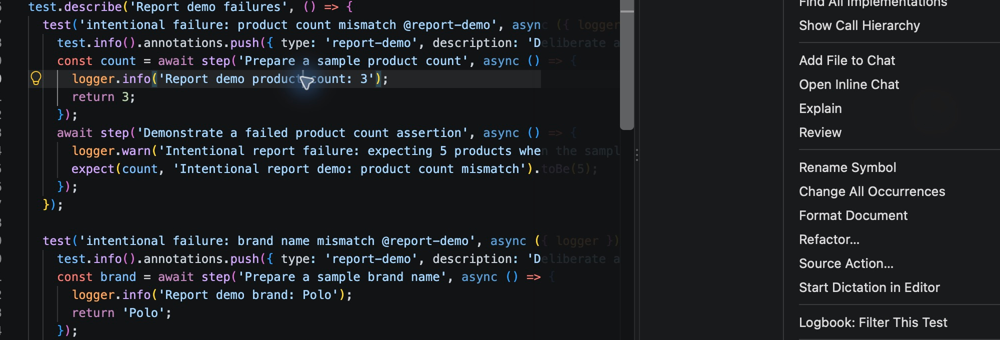
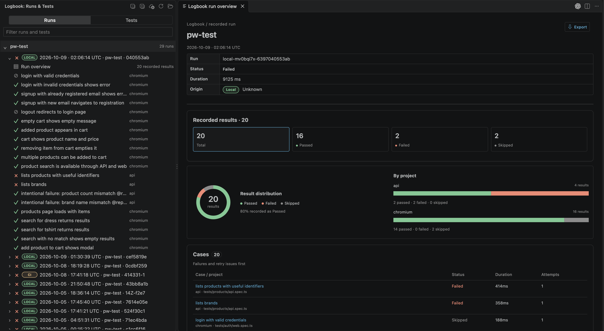
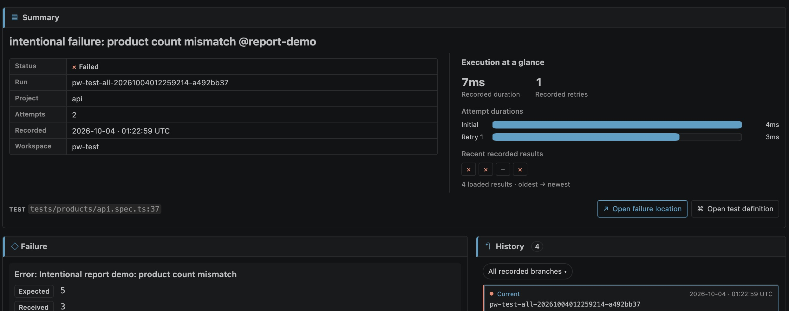
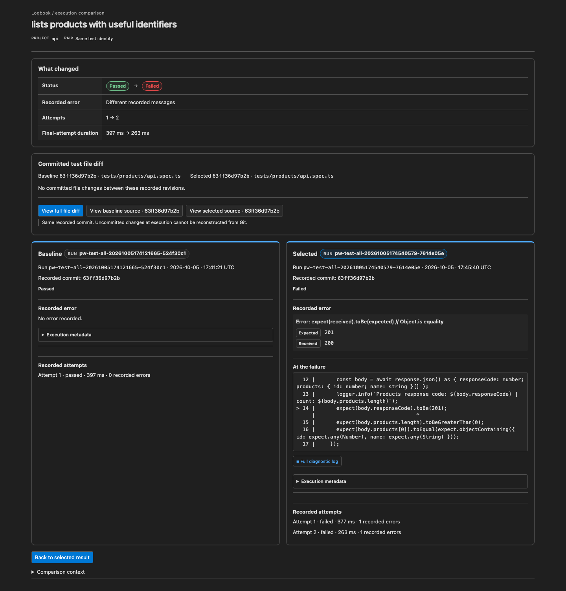
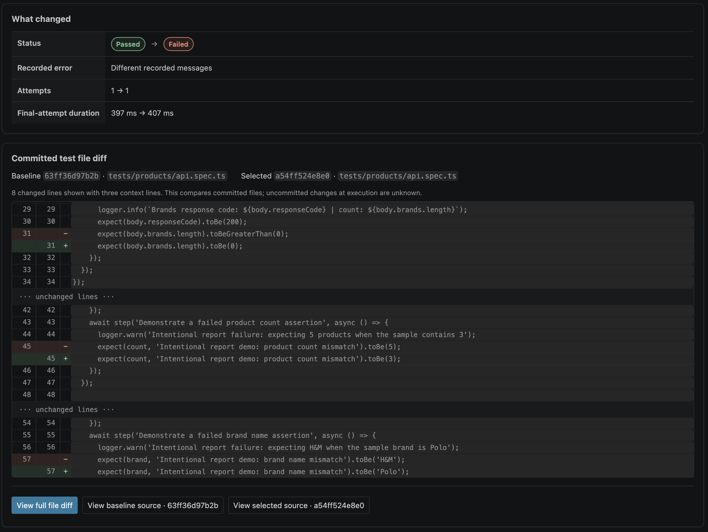
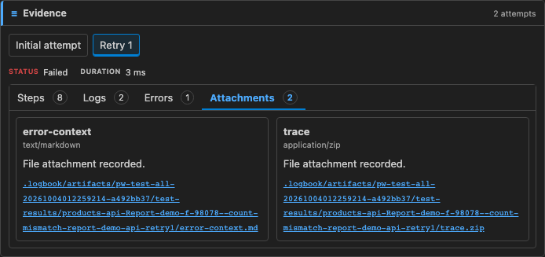
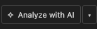
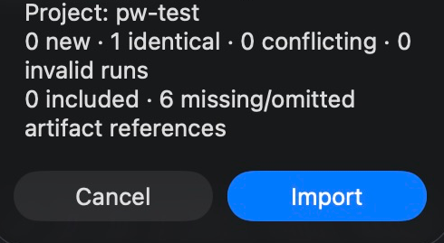

<p align="center">
  
</p>

# Playwright Logbook for VS Code

Browse recorded Playwright runs, inspect failures, compare history, and open evidence in your editor.


[](https://marketplace.visualstudio.com/items?itemName=krishnapollu.playwright-logbook-vscode)

## Get started

1. Install **Playwright Logbook** by **krishnapollu** from the [VS Code Marketplace](https://marketplace.visualstudio.com/items?itemName=krishnapollu.playwright-logbook-vscode).
2. Add the reporter to your Playwright project: `npm install --save-dev playwright-logbook`.
3. Add it to your existing `playwright.config.ts` reporter list:

   ```ts
   import { defineConfig } from '@playwright/test';

   export default defineConfig({
     reporter: [
       ['list'],
       ['playwright-logbook', { captureDetails: true }],
     ],
     use: { screenshot: 'only-on-failure', trace: 'on-first-retry' },
   });
   ```

4. Run `npx playwright test`, then open **Logbook** in VS Code's activity bar.

Keep `.logbook/index.jsonl` and `.logbook/runs/` to retain history. Open the folder containing your Playwright configuration. The extension needs desktop VS Code 1.95+; the reporter needs Node.js 20+ and Playwright 1.42+.

The sidebar always shows the open workspace folder above its runs. For a monorepo,
open its root folder. Logbook groups default stores in direct child
suites and `packages/*` under that folder; **Refresh** rescans for newly added or
removed suites. Each suite keeps separate runs and source paths. To configure a
suite's custom history or source mapping, open that suite as a VS Code workspace
folder and use the existing Logbook settings.
Folder descriptions show saved run counts. A workspace folder's count includes its
own history and every discovered child suite, independent of the loaded run page.
While a test filter is active, folder descriptions switch to the matching runs
currently loaded in the tree, marked `shown`. **Search older runs** extends that
window and updates the counts.

## Explore runs

- **One live filter:** Use the field above Recent Runs to search run ID, date, title, status, branch, commit, test name, ID, project, or path. **Search older runs** extends the loaded window; **Clear** resets it.
- **Spec shortcut:** Right-click a `.spec.*` or `.test.*` file in Explorer to filter to that file. Right-click inside a test in the editor to filter to that test.
- **Expand All / Collapse All:** Open or close visible folders and runs in Recent Runs.
- **Run overview:** Select a run's overview to see counts, project breakdown, and clickable cases. Run overviews and results open as ordinary tabs in the active editor group.
- **Run origin:** Recent Runs and run overviews show Local for runs outside the import catalog, CI for fetched GitHub runs, and Peer for runs from another configured tester. Imported ZIPs without recorded origin remain unmarked. Run overviews show the recorded tester or CI provider/build/attempt when available.
- **Share runs:** Use **Sync Team Runs** in the Recent Runs toolbar (or on a workspace folder) to pull shared runs into that folder. Use **Push Selected Run** on a Local run to review and publish only that run. Both actions read the shared filesystem store, project ID, tester, and local history path from that workspace's Playwright reporter config. They require a trusted local workspace.

To enable team sharing, add these options to the Logbook reporter in each teammate's Playwright config:

```ts
['playwright-logbook', {
  projectId: 'my-project',
  author: 'Alice',
  store: { type: 'filesystem', root: '../shared-logbook-store' },
}]
```

Use the same `projectId` and store path for everyone; set `author` per tester. A shared store is optional for local browsing and ZIP import.





## Investigate a failure

- **Result detail:** Read the recorded error, retries, source excerpt, steps, and logs. **Open failure location** and **Open test definition** jump to the current checkout.
- **Screenshots:** Playwright creates screenshot files; Logbook records their metadata. `captureDetails: true` adds eligible failed/flaky PNG or JPEG previews and captured steps/output to new runs.
- **History and comparison:** Select an earlier execution or choose **Compare**. The explicit committed-source diff needs Workspace Trust, local Git, and locally available recorded revisions.







### Test evidence

- Switch between attempts, then open **Steps**, **Logs**, **Errors**, or **Attachments**.
- Click an attachment path or image preview to open the recorded file in an IDE tab. Missing or unsafe files show an availability message.



## Analyze with AI

- **Start:** Select a test and choose **✧ Analyze with AI ▾**. Pick an installed assistant or native VS Code Chat once per workspace; the arrow changes that choice.
- **Evidence:** Logbook saves a bounded context file at `.logbook/analysis/<content-hash>.json` and gives the assistant a short task with a file reference. Accessible attachments are referenced by project-relative paths.
- **Review first:** The task is inserted as an unsent draft in supported assistants. Choose the model and submit it yourself. Logbook does not read the answer or automatically upload evidence.



Analysis requires Workspace Trust. Supported handoffs and evidence limits are described in [Advanced usage](https://github.com/krishnapollu/playwright-logbook/blob/main/packages/vscode/ADVANCED.md).

## Bring CI runs into local history

- For GitHub Actions, set `logbook.ciRepository` to `OWNER/REPO` in the workspace.
  The artifact name defaults to `logbook-run`; change `logbook.ciArtifactName`
  only if your workflow uses another name. Choose **Import Runs…** in Recent Runs,
  then **GitHub Actions**; sign in, select a recent artifact and review the import.
  No workflow ID or token in settings is needed. GitHub artifacts expire.
- Export a portable ZIP using the [bundle guide](https://github.com/krishnapollu/playwright-logbook/blob/main/docs/RUN-BUNDLES.md) (reporter 0.3.0+).
- Choose **Import Runs…** in Recent Runs, then **Local ZIP**; select ZIPs, enter the matching project ID, review the preview, and import.
- Imported runs join local history. Import does not publish to a shared store or assign a CI origin pill. Logbook does not fetch artifacts or check out commits.



## Custom project folder

For a nested project, use **Logbook: Select History Folder** and **Logbook: Configure Source Mapping**, or set project-relative paths:

```json
{
  "logbook.historyPath": "e2e/.logbook",
  "logbook.sourceRoot": "e2e"
}
```

Select the history folder containing `index.jsonl` and `runs/`. History refreshes automatically; **Logbook: Refresh History** refreshes it manually.

## Need help?

| Problem | Try this |
| --- | --- |
| No runs | Run tests with the reporter; check `logbook.historyPath` and refresh. |
| Missing logs, steps, or previews | Enable `captureDetails` and Playwright screenshots, then run again. |
| Source points to a different line | Check `logbook.sourceRoot`; the checkout may have changed since the run. |
| Older executions are missing | Retain the history files, check branch scope, and load more history. |

Desktop local workspaces are supported; Remote SSH, containers, and browser-based VS Code are not yet validated. Results stay in your project. Review logs and screenshots before sharing them. See [Advanced usage](https://github.com/krishnapollu/playwright-logbook/blob/main/packages/vscode/ADVANCED.md) for logger setup, agent handoff details, attachment limits, and privacy notes.

The screenshots use recorded results from the `pw-test` demo project. Images show only test data and project-relative paths.

[Reporter options](https://github.com/krishnapollu/playwright-logbook#reporter-options) · [Report an issue](https://github.com/krishnapollu/playwright-logbook/issues) · [Changelog](https://github.com/krishnapollu/playwright-logbook/blob/main/packages/vscode/CHANGELOG.md)
