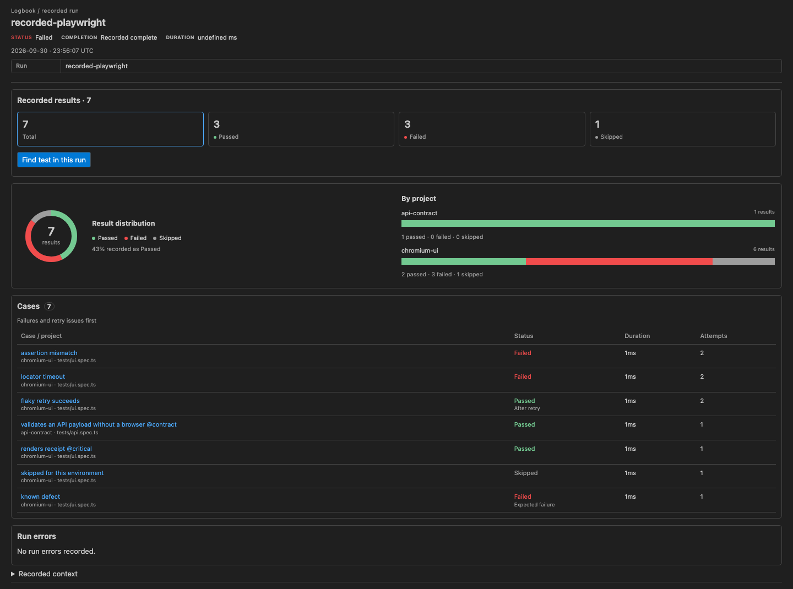
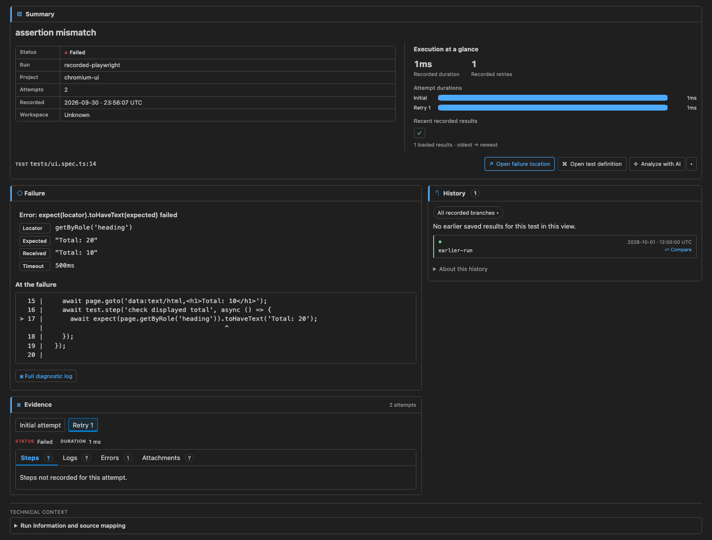

<p align="center">
  
</p>

# Playwright Logbook for VS Code

Investigate Playwright results without leaving your editor. Logbook brings saved
runs, test errors, attempts, logs and execution history together, with direct
navigation to your test source.

The extension reads records created by the **playwright-logbook reporter**. Install
both: the reporter collects results when Playwright runs; the extension displays
those saved results. They share the Logbook brand but are installed and versioned
independently.

This is a **desktop preview**, version **0.2.9**, published by `krishnapollu`.
The reporter and extension have independent version numbers.

## What you can do

- Browse recent runs and every test directly beneath its run.
- Open a run overview with totals, a result-distribution chart, project breakdowns
  and a clickable cases list.
- Inspect a test's error, assertion details and recorded source excerpt.
- Switch between attempts and review Steps, Logs, Errors and Attachments.
- See earlier executions of the same test alongside its error and compare two runs.
- Open the recorded failure location or test definition in your current checkout.
- Compare committed test-file content when both recorded revisions exist locally.

Logbook does not run your tests or fetch CI results. **Recorded** means saved in a
run record; it does not mean a video recording.

### Run overview



### Failure investigation



These are the extension's rendered panels using sample Playwright records.

## Install the extension

Use desktop VS Code **1.95 or newer** and a local project folder. This preview is
validated on macOS. Windows and Linux remain experimental; broader platform and
screen-reader validation is ongoing.
Remote SSH, containers, browser-based VS Code and virtual workspaces are not
supported by this preview.

Find **Playwright Logbook** by **krishnapollu** in the Extensions view and choose
**Install**, or use the CLI:

```sh
code --install-extension krishnapollu.playwright-logbook-vscode
```

[Open the Marketplace listing](https://marketplace.visualstudio.com/items?itemName=krishnapollu.playwright-logbook-vscode).

If you installed an earlier repository preview under `logbook-local-preview`,
uninstall that preview before installing this edition. Its publisher identity
differs, so VS Code otherwise treats them as separate extensions:

```sh
code --uninstall-extension logbook-local-preview.playwright-logbook-vscode
```

For offline installation with a Logbook `.vsix` file:

1. Open VS Code's Extensions view.
2. Open the **…** menu and choose **Install from VSIX…**.
3. Select the file, then reload the window if prompted.
4. Open the folder containing your Playwright project.

Alternatively, use the VS Code CLI:

```sh
code --install-extension path/to/playwright-logbook-vscode-0.2.9.vsix
```

If you are working from this repository, see [Build a local VSIX](#build-a-local-vsix).

## Set up result collection

In your Playwright project, install the reporter:

```sh
npm install --save-dev playwright-logbook@^0.3.0
```

The reporter supports Node.js 20+ and Playwright 1.42+. Reporter **0.3.0 or newer**
is required for CI bundle export. Add Logbook alongside your
existing reporters in `playwright.config.ts`:

```ts
import { defineConfig } from '@playwright/test';

export default defineConfig({
  reporter: [
    ['list'],
    ['playwright-logbook', {
      outputDir: '.logbook',
      captureDetails: true,
    }],
  ],
  use: {
    screenshot: 'only-on-failure',
    trace: 'on-first-retry',
  },
});
```

Merge these options into your existing configuration. `captureDetails: true`
enables steps, output and eligible screenshot embeds. Without it, basic outcomes,
errors and history are still available, but captured evidence may be absent.
Playwright creates screenshots and traces; Logbook records the available evidence.

Run tests normally:

```sh
npx playwright test
```

By default, Logbook writes its store beside your Playwright configuration:

```text
.logbook/
  index.jsonl
  runs/
    <run-id>.json
  report/
    index.html
```

Keep `index.jsonl` and `runs/` between runs to retain history. The extension reads
the records, not `report/index.html`. Open the configuration's containing folder
in VS Code, or configure the history and source paths below.

## Investigate a result

1. Choose **Logbook** in the activity bar and expand a recent run.
2. Choose **Run overview** for the big picture, or select any test in the flat list.
3. Read the **Summary** and **Failure / result diagnostics** sections.
4. Use **Evidence** to inspect the final recorded attempt, or switch to an earlier
   attempt and choose Steps, Logs, Errors or Attachments.
5. Review **History** beside the error. Choose an earlier run ID to inspect that
   execution, or **Compare** to compare it with the selected result.
6. Choose **Open failure location** or **Open test definition** to navigate to code.

The final attempt is selected initially. Arrow keys and Home/End navigate either
attempt or evidence tab row; Tab moves into the selected panel. Narrow editor
panes stack sections and summary graphics vertically.

### Summary and evidence

The summary's key/value table identifies the status, full run ID, project, attempt
count and recorded time, with available Git metadata. Its companion graphics show
recorded duration, retries, attempt durations and up to 12 loaded history results,
oldest to newest. The history strip represents the loaded scope, not all executions
that have ever happened.

| Evidence tab | What it shows |
| --- | --- |
| Steps | Captured steps and durations. A green check means no step error was recorded; it is not code coverage. |
| Logs | Captured stdout and stderr for that attempt. |
| Errors | Recorded attempt errors, including details from earlier failed retries. |
| Attachments | Attachment names/types and eligible embedded screenshot previews. |

The main error view prioritizes the headline, expected/received values and source
excerpt. Expand **Full diagnostic log** for the complete recorded diagnostic.
Missing metadata is labeled explicitly; **Not recorded** does not mean an event
never happened.

### Run overview and statuses

Overview always shows **Total, Passed, Failed and Skipped**, including zero counts.
Timeouts and interruptions count as Failed. Unknown statuses count only toward
Total and receive an explicit note, so the three status counts can add up to less
than Total.

Charts show the saved result distribution and breakdown by project. The cases list
shows up to 100 results, with failures and retry issues first. Click a case to open
its details. The project chart shows up to 20 projects; displayed limits are labeled.
**Find test in this run**, also available through the sidebar search action, searches
all saved results and offers outcome filters.

Counts describe actual recorded statuses. Expected failures, unexpected passes and
retry recovery retain short qualifiers in result views. Sidebar icons also reflect
these outcome semantics: an expected failure can have a green icon, while an
unexpected pass remains an issue. Text labels distinguish these cases.

Run errors, such as recorded setup errors, have their own sidebar group and overview
section. They are separate from the per-test counters. Saved totals do not establish
that every shard or execution was received.

### History and comparison

History matches the recorded test identity and project. Retries stay inside an
execution; repeated executions remain distinct. If branch metadata exists, history
starts on the selected run's branch; otherwise it includes all recorded branches.
Use the scope control to change this. Selecting an earlier result preserves the
original branch anchor. **Load more history** retrieves additional entries.

**Compare** pins the other execution as the baseline and the selected execution as
the comparison target. Changing selection or refreshing does not silently replace
that pair. The comparison shows status, errors and final-attempt duration; **Back to
selected result** returns to the pinned target.

Source buttons in the result view open your **current mapped checkout** at the
recorded location. Historical line numbers may have moved. The failure button
requires a structured error location; Logbook does not guess one from stack text.

Comparison can also open read-only source at the recorded commits and compare the
test file between them. These actions need Workspace Trust, supported local Git
and locally available revisions. They never fetch commits, check out branches or
modify files. Missing revisions or paths have an explicit unavailable state.
Committed source may differ from what ran if the working tree was dirty; its
historical state is unknown.

## Logs and screenshots

To select evidence types individually, use reporter options such as:

```ts
['playwright-logbook', {
  captureDetails: { steps: true, output: true, images: true },
  maxOutputLength: 10000,
}]
```

Output capture saves sanitized stdout/stderr tails, **2000 characters per stream
per attempt by default**. `maxOutputLength` changes that limit. `console.log`,
`console.warn` and framework loggers are visible when their output reaches the
captured test streams. Truncation is marked in the stored text. Browser-console
messages, file-only loggers and output outside a test are not automatically
attributed or collected; they need explicit producer integration. General-purpose
logger adapters are not implemented yet.

Screenshot previews require both Playwright screenshot capture and Logbook image
capture. The reporter embeds eligible PNG/JPEG images from unexpected or flaky
tests, with defaults of **250000 bytes per image** and **5000000 bytes per run**.
Oversized or missing images may retain metadata without a preview. The extension
previews up to 16 attachments per attempt, with its own bounded image limit.

Videos, traces, file-only screenshots and other attachments currently display
metadata and an unavailable-preview explanation. Video playback, trace viewing and
opening local artifact files from the extension are not implemented. Enabling
Playwright video recording alone does not enable playback here.

## Import a CI run into local history

Use **Import Run Bundle…** (cloud-download icon in Recent Runs) or its command
palette entry. Choose one or more exported Logbook ZIP files, then choose the
workspace history in a multi-root window. Import requires a trusted local desktop
workspace. The first import asks for the same stable project ID used by CI exports.

Review the target, new/identical/conflicting runs and included/missing evidence.
Confirm **Import**. Existing different records are retained; identical runs are
skipped and can gain additional artifacts. Valid runs can still be imported when
other bundles or runs are rejected. Cancellation keeps completed runs. Refresh
preserves your current selection; **Open Imported Run** opens a new run explicitly.

Matching imported and local executions blend in the normal History section.
Branch scope still applies. Configure Source Mapping if the target checkout root
differs; importing never checks out a commit or proves exact source alignment.
Captured logs and embedded screenshots are available in Evidence. External video,
trace and attachment files are retained for re-export; file preview/playback is
not part of this import feature.

See [bundle export, generated-file coverage and CI setup](https://github.com/krishnapollu/playwright-logbook/blob/main/docs/RUN-BUNDLES.md).

## Custom folders and copied CI records

The extension checks `.logbook` directly beneath each workspace folder. For a
custom location, run **Logbook: Select History Folder** from the Command Palette
or use the folder action in the Logbook sidebar. Select the store folder containing
`index.jsonl` and `runs/`, not an individual JSON file or the report folder.

For a CI ZIP, use **Import Run Bundle…** above. For manually copied JSON history:

1. Download or copy `index.jsonl` and its corresponding `runs/` records into a store.
2. Select that history folder in Logbook.
3. Use **Logbook: Configure Source Mapping** to select the local checkout root
   corresponding to recorded project-relative source paths.

The extension does not download CI artifacts or merge shards. Merge shard records
with the Logbook CLI before loading them; see the repository's [CI guide](https://github.com/krishnapollu/playwright-logbook/blob/main/docs/CI.md).
A single HTML report cannot supply history. File references in copied records do
not guarantee the referenced artifacts are present locally; embedded screenshots
travel with their run record.

Multi-root workspaces keep each folder's history separate. External history and
source mappings require Workspace Trust. In Restricted Mode, only contained
workspace paths are allowed. Source mapping identifies a checkout root; it does
not prove that the checkout matches the recorded revision.

## Extension settings

Set these in VS Code Settings under **Logbook**, or in workspace settings:

| Setting | Default | Purpose |
| --- | --- | --- |
| `logbook.historyPath` | `.logbook` | History-store path, relative to the workspace folder. |
| `logbook.sourceRoot` | `.` | Checkout root for recorded source paths. |
| `logbook.autoRefresh` | `true` | Refresh when saved history changes. |
| `logbook.historyLimit` | `20` | Initial test-history page size; range 1–100. |

Example for a repository with a nested Playwright project:

```json
{
  "logbook.historyPath": "e2e/.logbook",
  "logbook.sourceRoot": "e2e",
  "logbook.autoRefresh": true,
  "logbook.historyLimit": 20
}
```

Use **Logbook: Refresh History** if you need a manual refresh. Refresh preserves
the selected execution and comparison pair. A deleted record becomes unavailable
rather than switching to another test.

## Troubleshooting

| Symptom | What to check |
| --- | --- |
| No history found | Run tests with the Logbook reporter, then check the selected store contains `index.jsonl` and `runs/`. |
| My tests ran, but the sidebar is empty | Confirm the workspace folder and `historyPath` match the reporter's output location; then refresh. |
| Logs or steps say not recorded | Enable the relevant `captureDetails` options and run again. Old records cannot gain missing evidence retroactively. |
| Screenshot preview unavailable | Check Playwright screenshot capture, Logbook `images` capture, failed/flaky eligibility and image limits. A path alone is not an embedded image. |
| Source cannot open or goes to an old line | Check `sourceRoot` and the recorded relative path. Current source may have changed since the run. |
| Commit source/diff is unavailable | Check recorded commit metadata, local revision availability, Git installation and Workspace Trust. |
| Earlier runs are missing | Check retained records, history scope and Load more. Renamed or differently identified tests may not match. |
| Schema or malformed-record diagnostic | The preview supports schema 1 records. Keep compatible records together and review the reported file. |

## Data and current limits

The extension reads local records. It makes no automatic AI upload, CI download or
telemetry request. Reporter text is sanitized and supports custom `redact` rules;
screenshots cannot be redacted as text. Review records and images before sharing.

History gaps do not prove a pass, a first-ever failure or a common root cause.
Exact historical source alignment and shard completeness remain unknown when the
needed metadata is absent. Large stores use bounded reads and paging.

Embedded HTML report viewing and debug-context copying remain deferred. The
existing HTML report can be used independently of the extension.

## Build a local VSIX

These steps are for contributors or users building this preview from source.
From the repository root:

```sh
npm ci
npm run build
```

Then package from `packages/vscode`:

```sh
cd packages/vscode
npm exec --yes --package=@vscode/vsce -- vsce package --no-dependencies --out dist/playwright-logbook-vscode-0.2.9.vsix
```

Install the resulting file with **Install from VSIX…** or, from the repository root:

```sh
code --install-extension packages/vscode/dist/playwright-logbook-vscode-0.2.9.vsix
```

For development, open the repository and launch **Logbook extension development
host** with F5. It opens the real-world fixture in a separate extension host;
compatible history must exist or be generated by running its tests with Logbook.

Validation commands, from the repository root:

```sh
npm run check
npm run test:vscode
npm run test:vscode -- --vsix
```

The final command requires the version-matching VSIX to have been packaged. The
editor checks use VS Code 1.95.3 by default and use a disposable profile/workspace,
leaving your normal editor profile untouched. Use `--vscode-version VERSION` to
check another editor release. None of these commands publishes.
